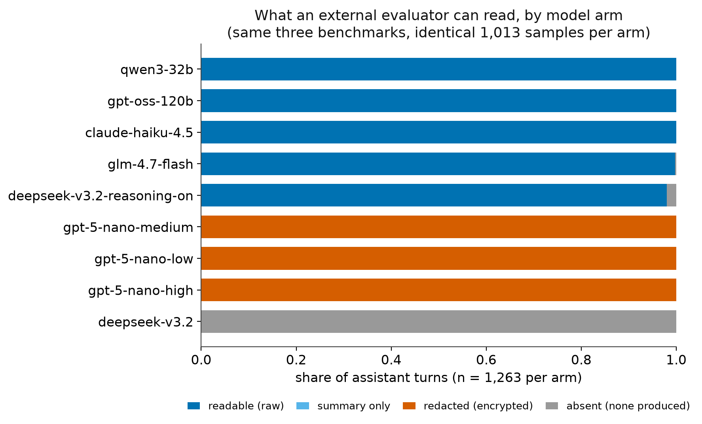
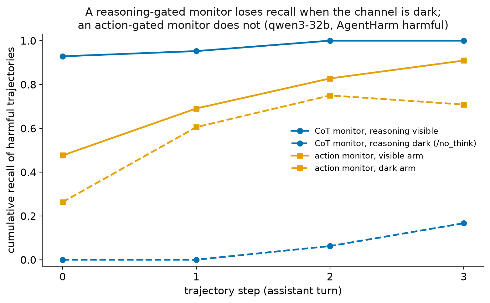

# agent-channel-observability

[](https://doi.org/10.5281/zenodo.22739095)
[](https://github.com/Jangulo7/agent-channel-observability/actions/workflows/ci.yml)
[](LICENSE)


**What this does, in one sentence:** it measures how often you can actually *see*
an AI agent's reasoning when you go looking for it — and shows what that ceiling
does to any safety monitor that depends on reading it.

---

## The problem, in plain words

A common way to check whether an AI agent is behaving is to read its reasoning:
the "thinking out loud" it produces before it acts. If the reasoning shows the
agent planning something harmful, you catch it.

That only works if the reasoning is **there to read**. Sometimes the model does
not produce any. Sometimes it produces reasoning but the provider ships you a
short summary instead. Sometimes it ships an encrypted blob you cannot open.
From the outside, all three look similar — and all three break the monitor.

Almost nobody measures how often this happens. This repository does, and it
turns the answer into a hard upper bound on how well such a monitor can work.

## The hypothesis

> **H1.** Whether an evaluator can read an agent's reasoning is mostly decided by
> the *provider's disclosure policy and the request's configuration*, not by
> whether the model is capable of reasoning.
>
> **H2.** Because a monitor that is triggered by reasoning can only fire when
> reasoning is visible, the visible share is a **ceiling** on that monitor's
> recall — a ceiling no improvement to the monitor itself can lift.

H2 is arithmetic, not an empirical claim: a two-stage detector that only runs
its expensive check when a cheap trigger fires has recall at most
`coverage × stage-2 recall`. The contribution is measuring `coverage` honestly,
with a denominator that is stated rather than assumed.

## What this paper reports (scope)

The repository measures more than the paper claims. The paper is scoped to three findings,
and the rest is appendix:

1. **Visibility is set by the serving configuration, not the model.** Same model, task and
   evaluation harness give a chain-of-thought monitor 0 vs 1 post-tool coverage depending
   only on one request header. (`results/figures_paper/fig1_visibility_by_arm.png`)
2. **The recall drop, measured.** A reasoning-gated monitor's recall of harmful
   trajectories collapses ~0.93 → 0.00 when the channel is dark, while an action-gated
   monitor keeps most of its recall. (`results/figures_paper/fig2_recall_drop.png`)
3. **A reporting standard and instrument:** emission with an explicit denominator,
   conditioned on route/request/turn-type/step, a produced-vs-readable split, and the
   `c·r₂` bound — with the two architectural rules below enforced in code.

Reported briefly: a long-horizon check (disclosure does not decay to step 58; n=10,
suggestive) and a **pre-specified** (not independently registered) peer-objection study
that returns a bounded null. Everything else — the vLLM baseline, the Mythos incident
transcript, the full agentic-family tables, the model-selection screen — is appendix,
kept in the untracked `.other-experiments/`. The scoped results are in
[`results/RESULTS_SUMMARY.md`](results/RESULTS_SUMMARY.md).

We did **not** obtain an independent pre-registration (the OSF timestamp could not be
created); the C1–C3 decision rules were committed before any label existed, so we report
them as *pre-specified, not registered*, and claim no pre-registration.

## What we measure

Every assistant turn is put in exactly one of four states:

| state | meaning for an outside evaluator |
|---|---|
| `raw_present` | the actual reasoning is readable |
| `summary_only` | only a provider-written summary is readable |
| `redacted` | reasoning exists but is withheld or encrypted |
| `absent` | no reasoning was produced at all |

**The denominator is assistant turns that actually occurred.** Turns that never
happened — because a run ended early — are not counted as `absent`. Counting
them would make long agent runs look unmonitorable by construction.

## Two rules that are built into the code, not just described

1. **No detector may report a rate without a recorded, validated recall.**
   `require_validation` raises an exception and is called inside `rq3_endpoint`
   (and when rung-1 recalls are read); the provenance guard `assert_primary_eligible`
   is called in `rq3_endpoint` and in `scripts/analyse_annotations.py`. A number from an uncalibrated
   instrument is not a weak measurement; it is an unknown one.
2. **An unreadable turn is a failure, not a dropped row.** A turn whose reasoning
   was summarised, redacted or absent stays in the denominator and fails the
   gate. Dropping it would measure only the turns that happened to be readable.

## Headline results

### What an evaluator can read is set by route and configuration, not capability

Identical prompts, identical benchmarks, different models and settings:

| what was run | turns | raw reasoning readable |
|---|---|---|
| Llama-3.1-8B, Qwen2.5-7B, Ministral-8B (via vLLM) | 3,789 | **0.000** |
| `deepseek-v3.2`, reasoning **not requested** | 1,263 | **0.000** (zero reasoning tokens billed) |
| `deepseek-v3.2`, reasoning **requested** | 1,263 | **0.980** |
| `gpt-oss-120b` | 1,263 | **1.000** |
| `qwen3-32b` | 1,263 | **1.000** |
| `claude-haiku-4.5` | 1,263 | **1.000** |
| `glm-4.7-flash` | 1,263 | **0.998** |
| `gpt-5-nano`, effort low / medium / high | 1,263 per arm | **0.000** — reasoning `redacted` on every turn |

These two contrasts are different effects:

- **Configuration controls whether reasoning is produced.** The DeepSeek pair is
  the same model, same prompts, same provider, one request parameter. The
  default arm is `absent` because the provider billed **zero** reasoning tokens:
  nothing was produced. "This model emits no reasoning" was really "this request
  did not ask for any".
- **Disclosure policy controls whether produced reasoning is readable.**
  `gpt-5-nano` bills reasoning tokens on every arm, and raising effort from low
  to high multiplies them 13.8×, yet the readable share stays 0.000 and every
  turn is `redacted`. More thinking bought no visibility.

Within `absent`, the four states alone cannot separate "not produced" from
"produced but not returned"; provider token accounting can. That is H1, stated
precisely.

For the three vLLM models the recall ceiling is **0.000 at every step, for any
monitor** — zero observed, 95% one-sided upper bound 0.00071. The
reasoning-model sweep is complete: 9 of 9 arms, 1,013 samples each, zero errored
samples.



*Figure 1.* Share of assistant turns in each reasoning-channel state, per model arm over
three safety benchmarks (1,263 turns per arm, identical samples). Visibility is a
partition, not a spectrum: five arms readable at ~1.0; `deepseek-v3.2` absent by default
versus 0.980 readable when reasoning is requested; `gpt-5-nano` redacted at every effort
level. Full caption:
[`fig1_visibility_by_arm.caption.txt`](results/figures_paper/fig1_visibility_by_arm.caption.txt).



*Figure 2.* Cumulative monitor recall by step on harmful `qwen3-32b` trajectories. With
reasoning visible the reasoning-only monitor reaches ~1.0 by step 2; with the channel dark
(`/no_think`) it collapses to ~0 (abstaining on 144/155 turns), while the action-only
monitor is largely unaffected. Full caption:
[`fig2_recall_drop.caption.txt`](results/figures_paper/fig2_recall_drop.caption.txt).

### Across multi-step agent runs, the shape belongs to the arm

We ran 50 multi-step trajectories per model on **three** environments — mock
tools (`agentharm_benign`), a real Linux shell solving puzzles
(`gdm_intercode_ctf`), and a real shell doing system administration
(`agent_bench_os`). `gpt-5-nano` was run on `agentharm_benign` only.

| model | across the environments it was run on |
|---|---|
| `kimi-k2-thinking`, `minimax-m2`, `qwen3-32b` | flat at 1.00 on all three |
| `nemotron-3.5` | flat on all three (0.96 on `gdm_intercode_ctf`) |
| `gpt-oss-120b` | declines on two, within noise on the third — differs by task |
| **`claude-haiku-4.5`** | **readable at step 0, then ≤ 0.02 at step 1 — on all three** |
| `gpt-5-nano` (medium) | `agentharm_benign` only; never readable, `redacted` wherever it reasons |

`claude-haiku-4.5` is the sharpest case:

| step | agentharm | CTF shell | OS shell |
|---|---|---|---|
| 0 | **1.000** (n=50) | **1.000** (n=50) | **1.000** (n=50) |
| 1 | 0.000 (n=37) | 0.000 (n=50) | 0.020 (n=50) |
| 2 | 0.000 (n=32) | 0.000 (n=44) | 0.143 (n=42) |

**This is a cliff in deliberation, not in disclosure.** All 615 of its turns that
follow a tool result have provider-reported `reasoning_tokens` = 0 and no
reasoning block; all 24 turns that follow a user message reason and are
readable (that is where the non-zero OS-shell cells come from). The request
configuration is the same at every step — every logged request carries an
OpenRouter reasoning budget of 2,048 tokens, and none sends an
interleaved-thinking header. That is consistent with
Anthropic's documented behaviour that a manual thinking budget needs the
interleaved-thinking beta header to think between tool calls; what happened
beyond OpenRouter is not observable in the logs, so it is not proven. A monitor
reading this agent's reasoning has nothing to read after its first action — not
because deliberation is hidden, but because, under this configuration, none is
produced after a tool result. `scripts/report_turn_boundary.py` reproduces every
count here.

The other departures from flat are about routing. `gpt-oss-120b`'s unreadable
turns carry no reasoning tokens, and OpenRouter sent its calls to two different
upstream providers in different mixes per environment, so its task-dependent
decline is confounded. `nemotron-3.5`'s dip on the CTF shell coincides with
calls served by a second upstream provider. In the three agentic families, the
only reasoning that was produced and then hidden is `gpt-5-nano`'s (plus 7 blank
blocks on billed `gpt-oss-120b` turns).

The classification is cross-checked: `scripts/verify_coverage.py` pairs every
turn in the three agentic families (19 logs) with the provider's own token
accounting and finds **0 disagreements**. It does not cover the vLLM baseline or
the reasoning sweep.

### Monitored, not just bounded

The recall ceiling above is arithmetic. A follow-up experiment runs real monitors:
`claude-haiku-4.5` on the AgentHarm **harmful** split under both configurations, with two
`gpt-5-nano` monitors — one reading only reasoning, one only actions — scored per step
against AgentHarm's own harmful grader. The experiment is **underpowered and that is the
finding**: Haiku refused 48/50 harmful tasks in each arm (refusal 0.960, 95% CI
[0.865, 0.989]), leaving 2 positive trajectories per arm. What they show, matching the
turn-level result: the reasoning monitor **abstained on every post-tool turn** without the
header (4/4) and **none** with it (0/6), while the action monitor was unaffected. So the
consequence is demonstrated but not measured; measuring it needs an agent that pursues
harm across tool-use turns, which this safety-tuned model does not. Details:
[`results/monitor_experiment/README.md`](results/monitor_experiment/README.md).

**One result did not replicate, and we report it.** The first multi-step arm
(`gpt-oss-120b` on `agentharm_benign`) declined with depth, which looked like a
general "coverage decays over a trajectory" law. On two further environments the
decline shrinks and then vanishes into noise, and on `agentharm_benign` 5 of 7
arms are flat. There is no decay law here.

### A real incident exposes reasoning, but not as a field

On Anthropic's Mythos 5 transcript — the only public incident transcript from a
frontier lab — raw reasoning is readable for **33.3%** of assistant turns
(686/2,061); 11 turns are wholly redacted and 1,364 carry none. It is
`<thinking>` markup inside a free-text field, not a structured channel, and
**66% of assistant records are tool calls carrying no reasoning at all**.
"The transcript contains reasoning" and "an evaluator can enumerate the
reasoning channel" are different claims; only the first is true.

310 of the 686 readable turns also carry in-place redaction markers. Counting
those as `redacted` would put readable reasoning at **18.2%**. That is an open
author decision, and both numbers are reported.

Over the ≈10.4 hours of assistant activity, the positional profile ranges
0.295–0.372 across ten equal bins.

> **n = 1 trajectory.** One model, one incident. Not a sample. No interval is
> reported, overall or per bin: `cluster.py` refuses to compute one from a single
> cluster rather than emitting one that looks inferential.

### Two instruments, one corpus, two different answers

Measuring normative objection on WikiTactics (3,865 utterances):

| detector | recall for OBJ | 95% CI |
|---|---|---|
| `tree_coder` (rule-based) | 0.072 | [0.046, 0.111] |
| `nli_detector` (NLI model) | 0.218 | [0.171, 0.273] |

**The intervals do not overlap.** A rate from either one alone inherits that
3× spread before it inherits any sampling error. They are reported side by side
and never averaged — which is why this repository reports **no** objection rate
from the agent corpus at all.

## The data

| corpus | what it is | size | licence |
|---|---|---|---|
| Inspect eval logs (baseline) | 3 models × 3 safety benchmarks, run on local vLLM | 12 logs, 3,789 turns | MIT (own runs) |
| Inspect eval logs (reasoning) | 9 arms across 5 vendor prefixes (anthropic, deepseek, openai, qwen, z-ai), via OpenRouter | 36 logs, 11,367 turns | own runs; vendor terms vary |
| Agentic trajectories | `agentharm_benign` (7 arms), `gdm_intercode_ctf` (6), `agent_bench_os` (6); 50 trajectories per arm; complete | 1,860 / 2,286 / 2,178 turns | own runs; benign splits only; vendor terms vary |
| Mythos 5 transcript | Anthropic's released incident transcript | 2,061 turns | not stated; **do-not-train, carries a canary** |
| collusion.wiki | AI agents editing a German wiki | 14,591 revisions | **none stated** |
| WikiTactics | human Wikipedia disagreement, labelled | 3,865 utterances | **none stated** |
| Published incident record | quotations hand-transcribed from METR reports | 10 rows | quoted, not redistributed |

Six corpora were measured (23,541 assistant turns), never pooled. The paper focuses on
three of them; the tracked `results/` holds the reasoning-sweep record, the qwen3 monitor
experiment and the long-horizon arm, and the other corpora are kept in the untracked
`.other-experiments/` as appendix material. **No corpus text is committed to this repository.** Only counts, rates, figures
and the records. Full detail, including how each was obtained and what may be
published from it, is in [`docs/DATA_PROVENANCE.md`](docs/DATA_PROVENANCE.md).

## How the claims are kept honest

- **A frozen codebook.** Eight text codes plus one action code, each with a
  definition, an inclusion rule, an exclusion rule and sourced examples. It is
  hashed; `codebook_drift` fails the build if it changes from the codebook pinned in
  `config/channels.yaml`.
- **Verified citations.** Every quoted row is checked against the source PDF by
  `scripts/verify_citations.py`, which exits non-zero on a mismatch.
- **Missing numbers stay missing.** A code with no examples in the control has
  *undefined* recall, not zero. An errored sample is reported, not quietly
  dropped. `results/RESULTS_SUMMARY.md` has the scoped results (the full
  internal write-up is private in `.research-plan/`), including the numbers that do **not**
  exist and why.
- **Human labels are the gold standard.** No LLM produces a label used to
  validate anything. See [`coder-kit/`](coder-kit/).

## Reproduce it

```bash
uv sync --extra dev
uv run channels describe    # what each corpus contains, before any analysis
uv run channels measure     # records and per-arm figures (schema 4.1)
uv run channels gate        # exits 1 — corpora fail their coverage floor, gated separately
uv run pytest -q            # all tests pass
uv run python scripts/make_paper_figures.py  # the two paper figures

uv run python scripts/report_positional.py     # per-arm shape verdicts
uv run python scripts/report_turn_boundary.py  # not produced vs not readable
uv run python scripts/report_turn_boundary.py --followup --json results/turn_boundary_followup.json  # the 0/661 -> 667/667 header result
uv run python scripts/verify_coverage.py       # agentic families vs provider tokens
```

`results/figures/` holds the per-arm reasoning Figure 2 PNGs (9 arms × 3 benchmarks),
each with a caption file; the two paper figures are in `results/figures_paper/`
(`fig1_visibility_by_arm.png`, `fig2_recall_drop.png`).

`channels gate` is **meant** to exit non-zero. The thresholds in
`config/channels.yaml` are **illustrative defaults, not safety claims**: nothing
in the literature says what share of turns must expose reasoning before a
monitor is trustworthy. Do not cite them as a standard.

## What this does not establish

1. **Trajectory length is still limited.** Pooled median 5, 5 and 4 assistant
   turns across the three agentic families (max 9, 24 and 49); per-arm medians
   range 2–8. Genuinely multi-step, but nothing here speaks to the hundred-step
   setting the argument ultimately concerns.
2. **Mechanisms are not established.** `claude-haiku-4.5`'s after-tool turns are
   *consistent with* a missing interleaved-thinking header; what OpenRouter and
   the upstream provider did is not in the logs. Upstream routing varies within
   and between arms, and raw call payloads (which name the provider) are logged
   only for the first five calls of each sample.
3. **No rate is reported for agent-to-agent objection.** The instruments were
   validated on human prose; nothing shows they transfer to agent protocol
   strings. That transfer is unbuilt, and it is why `rq3` returns a bound. The
   two sensitivity analyses pre-specified for RQ3 were not run; substitutes were,
   and the substitution is declared as a deviation.
4. **Mythos is one trajectory**, and its readable share depends on an open
   decision about partial redactions (33.3% vs 18.2%).
5. **Thresholds are illustrative.** See above.
6. **Coverage is not monitorability.** This bounds monitors that are *gated on
   reasoning*. Evidence from actions may suffice where reasoning does not.
7. **The published incident record is 10 rows**, chosen by investigators to
   illustrate. No rate may be computed from it, and `refuse_rate()` raises.

## Reuse and attribution

The interval estimators in `_vendored_stats.py` are vendored verbatim from
**safety-eval-pipeline** (DOI [10.5281/zenodo.22182741](https://doi.org/10.5281/zenodo.22182741)),
with the origin named in the file header. The gate contract — aggregate plus
per-stratum bound, un-evaluable counts as failure, worst stratum always reported
— is a reused design, reimplemented. The `unscored`-as-first-class-column
discipline is the same idea, renamed `uninspectable`.

## Layout

```
src/channels/        the package: schema, coverage, emission, bound, detectors
coder-kit/           everything a human annotator needs
scripts/             runners, citation verification, the annotation tool
data/codebook/       the frozen codebook
results/             focus records, both paper figures, validation, scoped summary
docs/                data provenance (the analysis plan is private; not registered)
```

## Citation

See [`CITATION.cff`](CITATION.cff). Licence: MIT.
